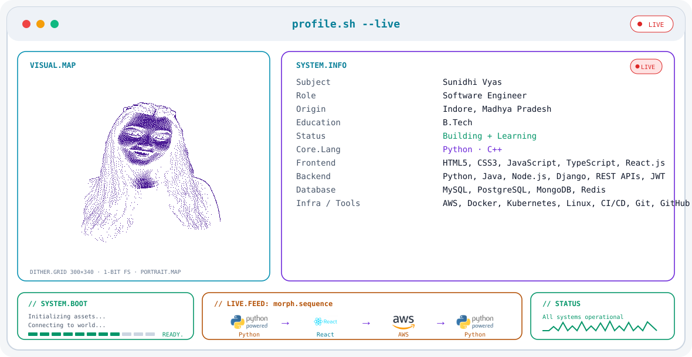

<picture>
  <source media="(prefers-color-scheme: dark)" srcset="./dark.svg">
  <source media="(prefers-color-scheme: light)" srcset="./light.svg">
  
</picture>

<br>

# 👋 Hi, I'm Sunidhi Vyas

### Software Engineer

Building, learning, and shipping software with a focus on full-stack development.

📍 Indore, Madhya Pradesh  
🎓 B.Tech  
💻 Python · C++

---

## 🛠️ Tech Stack

### Frontend
- HTML5
- CSS3
- JavaScript
- TypeScript
- React.js
- Next.js
- Tailwind CSS
- React Router
- Axios

### Backend
- Python
- Java
- Node.js
- Django
- REST APIs
- JWT
- GraphQL
- Microservices

### Database
- MySQL
- PostgreSQL
- MongoDB
- Redis

### Infrastructure & Tools
- AWS
- Docker
- Kubernetes
- Linux
- CI/CD
- Git
- GitHub

---

## 📊 GitHub Stats

<p align="center">
  
  
</p>

---

## 🔥 GitHub Streak

<p align="center">
  
</p>

---

## 🌐 Connect With Me

<p align="left">
  <a href="https://www.linkedin.com/in/sunidhi-vyas-56b550218/">
    
  </a>

  <a href="mailto:vyaskhushi14@gmail.com">
    
  </a>
</p>

---

## 🚀 Currently

```text
Building  →  Learning  →  Improving
